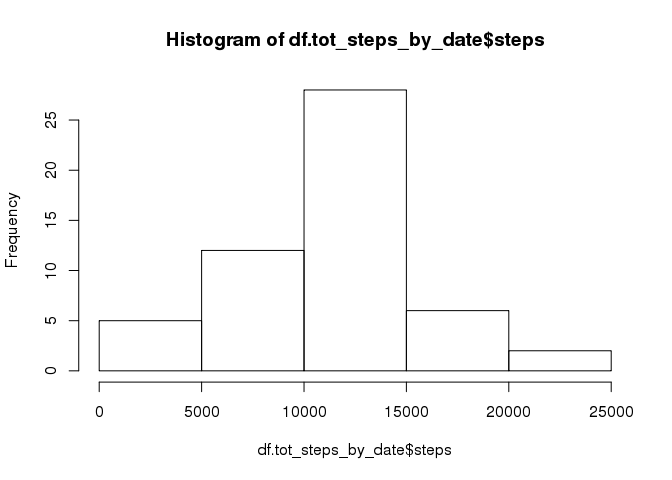
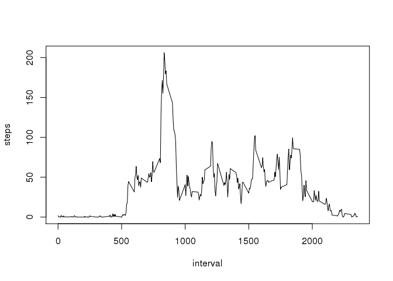
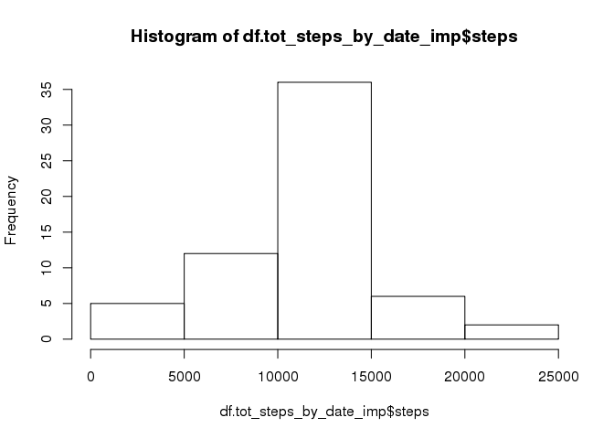
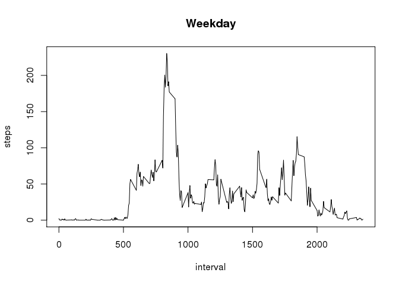
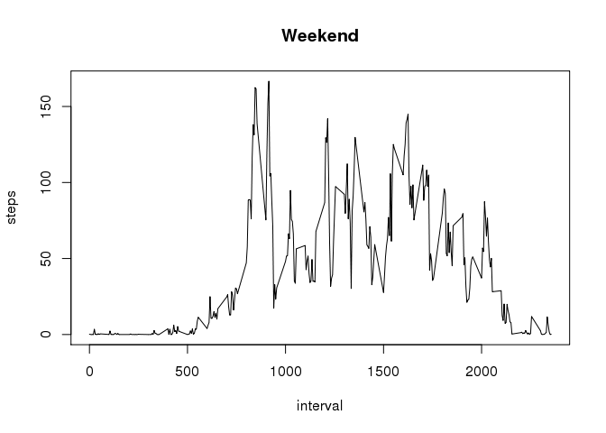

# Reproducible Research: Peer Assessment 1
## Loading and Preprocessing the Data

Download and unzip the file and read the file into a data frame


```r
#get the file and unzip
archiveDF <- "activity.zip"

if(!file.exists(archiveDF)) {
  archiveURL <- "https://d396qusza40orc.cloudfront.net/repdata%2Fdata%2Factivity.zip"
  download.file(url=archiveURL,destfile=archiveDF,method="curl")
}

if(file.exists(archiveDF)){
  unzip(archiveDF)
}

# Code for reading in the dataset and/or processing the data

df.activity <- read.csv("activity.csv", header=T)
print(summary(df.activity))
```

```
##      steps                date          interval     
##  Min.   :  0.00   2012-10-01:  288   Min.   :   0.0  
##  1st Qu.:  0.00   2012-10-02:  288   1st Qu.: 588.8  
##  Median :  0.00   2012-10-03:  288   Median :1177.5  
##  Mean   : 37.38   2012-10-04:  288   Mean   :1177.5  
##  3rd Qu.: 12.00   2012-10-05:  288   3rd Qu.:1766.2  
##  Max.   :806.00   2012-10-06:  288   Max.   :2355.0  
##  NA's   :2304     (Other)   :15840
```

## What is mean total number of steps taken per day?

Aggregate the steps for each date.  NA values are ignored at this point.  Mean and median are calculaed and pinted.  For plotting the average steps over time interval, another aggregation is done with mean as FUN. The aggregated data frame is plotted.  Also, the interval that has the maximum average steps is also printed out.


```r
# Histogram of the total number of steps taken each day
df.tot_steps_by_date <- aggregate(steps~date, df.activity, FUN=sum, na.rm=T)
# View(df.tot_steps_by_date)
print(summary(df.tot_steps_by_date))
```

```
##          date        steps      
##  2012-10-02: 1   Min.   :   41  
##  2012-10-03: 1   1st Qu.: 8841  
##  2012-10-04: 1   Median :10765  
##  2012-10-05: 1   Mean   :10766  
##  2012-10-06: 1   3rd Qu.:13294  
##  2012-10-07: 1   Max.   :21194  
##  (Other)   :47
```

```r
print(str(df.tot_steps_by_date))
```

```
## 'data.frame':	53 obs. of  2 variables:
##  $ date : Factor w/ 61 levels "2012-10-01","2012-10-02",..: 2 3 4 5 6 7 9 10 11 12 ...
##  $ steps: int  126 11352 12116 13294 15420 11015 12811 9900 10304 17382 ...
## NULL
```

```r
hist(df.tot_steps_by_date$steps)
```

<!-- -->

```r
# Mean and median number of steps taken each day
print(mean(df.tot_steps_by_date$steps))
```

```
## [1] 10766.19
```

```r
print(median(df.tot_steps_by_date$steps))
```

```
## [1] 10765
```

```r
# Time series plot of the average number of steps taken
df.avg_steps_by_interval <- aggregate(steps ~ interval, data=df.activity, FUN=mean, na.rm=T)
#View(df.avg_steps_by_interval)
str(df.avg_steps_by_interval)
```

```
## 'data.frame':	288 obs. of  2 variables:
##  $ interval: int  0 5 10 15 20 25 30 35 40 45 ...
##  $ steps   : num  1.717 0.3396 0.1321 0.1509 0.0755 ...
```

```r
plot(df.avg_steps_by_interval, type="l")
```

<!-- -->

```r
# The 5-minute interval that, on average, contains the maximum number of steps
print(df.avg_steps_by_interval$interval[which.max(df.avg_steps_by_interval$steps)])
```

```
## [1] 835
```
## Imputing missing values

The innterval average for steps is imputed for steps field.  The code below prints out total occurence of NAs. the mean and median is again computed after imputing the values.  You will see the average staying the same and the median got very close to the mean!


```r
# Code to describe and show a strategy for imputing missing data
print(sum(is.na(df.activity)))
```

```
## [1] 2304
```

```r
df.activity_bak <- df.activity

df.activity <- merge(df.activity, df.avg_steps_by_interval, by = "interval", suffixes = c("",".y"))
#pick all NAs in steps

df_nas <- is.na(df.activity$steps)
str(df.activity)
```

```
## 'data.frame':	17568 obs. of  4 variables:
##  $ interval: int  0 0 0 0 0 0 0 0 0 0 ...
##  $ steps   : int  NA 0 0 0 0 0 0 0 0 0 ...
##  $ date    : Factor w/ 61 levels "2012-10-01","2012-10-02",..: 1 54 28 37 55 46 20 47 38 56 ...
##  $ steps.y : num  1.72 1.72 1.72 1.72 1.72 ...
```

```r
df.activity$steps[df_nas] <- df.activity$steps.y[df_nas]

df.tot_steps_by_date_imp <- aggregate(steps~date, df.activity, FUN=sum, na.rm=T)
hist(df.tot_steps_by_date_imp$steps)
```

<!-- -->

```r
print(mean(df.tot_steps_by_date_imp$steps))
```

```
## [1] 10766.19
```

```r
print(median(df.tot_steps_by_date_imp$steps))
```

```
## [1] 10766.19
```

```r
# View(df.tot_steps_by_date_imp)
```
## Are there differences in activity patterns between weekdays and weekends?

Another factor is added to the data frame to denote whether the date falls on a weekend or weekdays.  This helps to segregate the data frame into weekdays and weekends so two charts can be plotted - one for weekend activity pattern and the other for weekday activity pattern.  Both plots are timeseries plots.

If you inspect the chart, you will seee that the activity on weekdays are in general a lot less than the weekend.


```r
# Panel plot comparing the average number of steps taken per 5-minute interval across weekdays and weekends

fn_daytype <- function(x){
  ifelse(weekdays(as.Date(x)) %in% c("Saturday","Sunday"), "Weekend", "Weekday")
}

daytype <- fn_daytype(df.activity$date)

df.activity$daytype <- daytype
# View(df.activity)

for (dt in levels(as.factor(df.activity$daytype))){
  print(dt)
  dtfactor.plotvar <- aggregate(steps~interval, df.activity, FUN=mean, subset=df.activity$daytype==dt)
  plot(dtfactor.plotvar, type ="l", main= dt)
}
```

```
## [1] "Weekday"
```

<!-- -->

```
## [1] "Weekend"
```

<!-- -->
